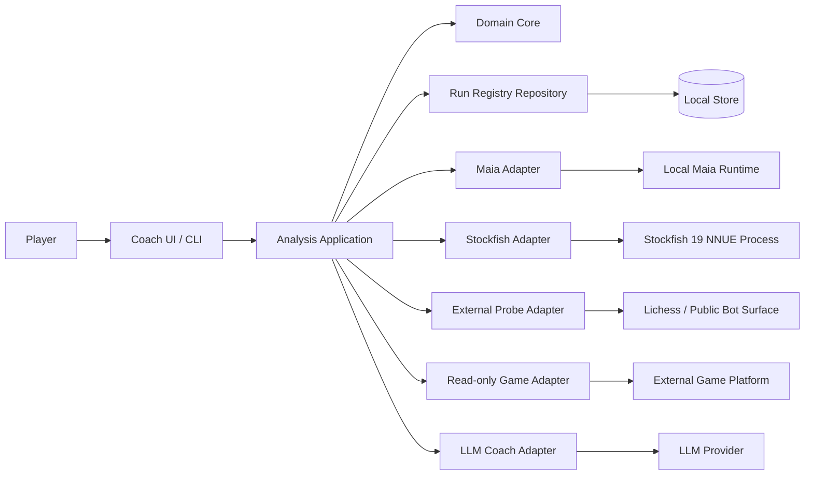

# Architecture

## Architectural goal

Chess Trainer is a deliberative coaching system. It must make the Player's reasoning explicit, generate transparent mixed-source scenario lines, and explain them without pretending that a bot or engine produced moves it did not produce.

The architecture is designed to prevent the known failure modes of conversational chess analysis: state drift, illegal moves, missed forcing moves, source confusion, and unsafe external side effects.

## Style

The implementation should follow a functional-core / imperative-shell architecture:

- **Domain core:** immutable data, discriminated unions, pure functions, validation policies, sequencing policies.
- **Application shell:** orchestration, session workflow, provider calls through ports, persistence coordination.
- **Adapters:** UCI, process execution, Maia runtime, Lichess/API access, filesystem, database, LLM provider integration.

The domain model is data-oriented and anemic by design. Behavior lives in pure functions rather than rich mutable objects.

## Logical containers



## Dependency rule

```text
adapters -> application -> domain
```

Allowed examples:

- `application` imports `domain` types and functions.
- `adapters/stockfish` imports `application` port types and returns domain-shaped values.
- `domain` imports no adapter, process, HTTP, database, filesystem, time, UUID, or vendor package.

Forbidden examples:

- domain function starts a Stockfish process;
- domain type contains a raw Lichess response object;
- scenario policy checks `process.env`;
- coach prose is used as the source of move provenance.

## Suggested module layout

```text
src/
  domain/
    chess/                  # PositionSnapshot, LegalMove, notation parsing contracts
    analysis/               # AnalysisSession, CandidateSeed, ScenarioLine
    provenance/             # MoveProvenance, source types, completeness policy
    policy/                 # HumanPath sequencing, stop rules, safety policies
    result.ts               # Result and DomainError ADTs
  application/
    ports/                  # MaiaMoveProvider, StockfishMoveProvider, repositories
    services/               # startSession, generateHumanPath, reviewSession
    events/                 # structured event builders
  adapters/
    stockfish/              # UCI process implementation
    maia/                   # Maia runtime implementation
    lichess/                # read-only import and automated bounded external probe integration
    persistence/            # filesystem/sqlite/postgres implementations
    llm/                    # CoachAssessment rendering adapter
  cli-or-ui/
```

## Primary data flow

```text
raw FEN/PGN/import
  -> ingestPositionSnapshot
  -> AnalysisSession with PlayerAssessment/PlayerPlan
  -> ingestCandidateSeed(s)
  -> generateHumanPath through provider ports
  -> validate every returned move and provenance
  -> persist run/provenance records
  -> CoachAssessment from structured data
  -> Player Decision record
```

## HumanPath sequence

For a Player-to-move position:

```text
ply 1: CandidateSeed
ply 2: Maia models Opponent response
ply 3: Stockfish 19 NNUE continues Player side
ply 4: Maia models Opponent response
ply 5: Stockfish 19 NNUE continues Player side
...
```

The same source ordering must be visible in data and UI. If an external bot supplied the seed, only ply 1 receives that bot's provenance unless a real full observed game record exists.

## Ports

Application code should depend on ports such as:

```ts
type MaiaMoveProvider = (request: MaiaMoveRequest) => Promise<Result<ProvidedMove, ProviderError>>;
type StockfishMoveProvider = (request: StockfishMoveRequest) => Promise<Result<ProvidedMove, ProviderError>>;
type ExternalCandidateProbe = (request: ExternalProbeRequest) => Promise<Result<CandidateSeed, ProbeError>>; // automated Lichess game-probe lifecycle
type GamePositionReader = (request: GameImportRequest) => Promise<Result<PositionSnapshot, ImportError>>;
type ScenarioRunRepository = (record: ScenarioRunRecord) => Promise<Result<void, RepositoryError>>;
type CoachReviewProvider = (request: CoachReviewRequest) => Promise<Result<CoachAssessment, CoachError>>;
```

The exact TypeScript names may change, but the boundary idea must remain: providers return typed data plus provenance; the domain validates policy.

## Validation gates

Each gate should fail closed:

1. **Input gate:** reject invalid FEN/PGN/move notation.
2. **Seed gate:** reject illegal or unprovenanced seeds before engines are called.
3. **Provider gate:** reject malformed, missing-provenance, or illegal provider outputs.
4. **Sequence gate:** reject source-order violations in HumanPath.
5. **Safety gate:** block external writes in ordinary analysis.
6. **Coach gate:** prevent coach text from inventing facts not present in structured data.

## Error model

Expected failures should be represented as data:

- `INVALID_FEN`
- `ILLEGAL_MOVE`
- `MISSING_PROVENANCE`
- `PROVIDER_TIMEOUT`
- `PROVIDER_MALFORMED_OUTPUT`
- `PROVIDER_ILLEGAL_MOVE`
- `SOURCE_SEQUENCE_VIOLATION`
- `EXTERNAL_WRITE_FORBIDDEN`
- `PROBE_QUOTA_EXCEEDED`
- `SECRET_REDACTED`

Errors should include a stable code, path, human-readable message, and relevant identifiers such as position hash or provider name.

## Events and observability

Use structured append-only events, for example:

```json
{"event":"analysis_session_started","sessionId":"...","positionHash":"...","sideToMove":"white"}
{"event":"candidate_seed_rejected","sessionId":"...","code":"ILLEGAL_MOVE","move":"Qh5"}
{"event":"provider_move_accepted","runId":"...","provider":"maia","source":"MAIA","move":"..."}
```

Events must not include secrets or raw authorization headers.

## External writes

Normal analysis is read-only with respect to the Player's real game. ExternalProbe is a separate opt-in automated Lichess game-probe command for disposable casual probe games only; it is not ordinary analysis and not a real-game move submission. Any other write-capable integration, if ever added, must be a separate command path with:

- dedicated OpenSpec change;
- new ADR or superseding ADR;
- explicit destination and move preview;
- user confirmation;
- audit record;
- tests proving ordinary analysis cannot call it.

## Licensing and runtime isolation

Stockfish, Lc0-derived systems, Maia weights, and other engines/models may have different licenses. Do not assume binary and weight licenses are the same. Runtime adapters should record:

- binary name and version;
- model/weights identity;
- source URL or registry reference when known;
- hash when available;
- license/terms reference;
- runtime configuration.

## Chess-specific reliability layer

Before any coaching explanation, the system should be able to derive deterministic board facts from `PositionSnapshot` and line moves:

- material inventory;
- side to move;
- legal checks;
- legal captures;
- attacked high-value pieces;
- checkmate/stalemate/draw state;
- pawn promotions and passed pawns;
- repetition/halfmove metadata when available.

The LLM coach should consume these facts instead of reconstructing the board from memory.

## Local StylePath CLI mode

The first local CLI analysis mode does not use Lichess probes or Stockfish. It builds independent `StylePath` lines for configured local style engines:

```text
Patricia: Patricia -> Maia 1900 -> Patricia -> Maia 1900 -> ...
Jackal:   Jackal   -> Maia 1900 -> Jackal   -> Maia 1900 -> ...
Seer:     Seer     -> Maia 1900 -> Seer     -> Maia 1900 -> ...
```

On Windows, `--engine-suite cstal-windows` switches the same orchestration to CSTal ABSURD and CSTal EXTREME with the selected Maia opponent. The default `--cstal-opponent maia3` renders; `--maia3-elo` changes Maia3 Elo conditioning:

```text
CSTal ABSURD vs Maia3:     CSTal ABSURD  -> Maia3 79M  -> CSTal ABSURD  -> Maia3 79M  -> ...
CSTal EXTREME vs Maia3:    CSTal EXTREME -> Maia3 79M  -> CSTal EXTREME -> Maia3 79M  -> ...
```

`--cstal-opponent maia1900` renders:

```text
CSTal ABSURD vs Maia 1900: CSTal ABSURD  -> Maia 1900 -> CSTal ABSURD  -> Maia 1900 -> ...
CSTal EXTREME vs Maia 1900: CSTal EXTREME -> Maia 1900 -> CSTal EXTREME -> Maia 1900 -> ...
```

The final side to move after FEN or RAW SAN ingestion is the Player side for that CLI run. The same local style engine owns all odd plies in its line. Maia owns all even plies. Provider failures are represented as incomplete lines and do not contaminate other lines.

UCI process management belongs only in adapters. The domain sees provider results, move provenance, and typed failures; it never imports `child_process`, UCI protocol code, filesystem watchers, or engine binaries. Windows `.exe` engines and Python-backed Maia3 commands are configured only in wiring and ignored local runtime config.

### Local runtime resource defaults

Patricia and Seer are the primary local style engines and run with 2 CPU threads plus a 10 GB hash budget. Jackal runs with 1 CPU thread plus a 10 GB hash budget because it is slower and has UCI completion quirks. The Maia opponent model runs with 4 seconds movetime, 6 CPU threads/task workers/searchers, `MinibatchSize=32`, and a 10 GB RAM limit.

### StylePath CLI rendering and refresh

The StylePath CLI renders each line as normal SAN movetext. For RAW SAN input, the original game text is replayed from the initial position and the generated continuation is appended with normal move numbering. User-facing `--horizon` is intentionally removed: watch mode starts at horizon 8 full moves. Patricia and Seer start at depth 13, CSTal ABSURD/EXTREME start at depth 14, and Jackal starts at depth 8 to keep updates responsive. Watch mode updates engine lines independently as new plies are appended. For engines with fixed configured depths, the displayed global style-depth setting is not escalated because it would not improve those lines. Horizon extends every 10 seconds while the rendered line remains stable. Horizon extension continues from the existing line tail; it must not restart a root pass or recalculate already accepted plies. There are no product-level max depth or max horizon caps; technical subprocess timeouts, serial queues, and clean shutdown remain in force.

In watch mode, the CLI keeps per-engine line state in memory and extends each line from its current tail. It restarts from the root only when the ingested input changes or the process is restarted. Transient provider failures are retryable on the same ply; permanent validation failures remain visible as structured incomplete-line errors. UCI adapters keep a persistent queued process per provider instance so repeated refreshes do not respawn the engine process for every request.

### Continuous mixed StylePath semantics

Watch mode does not stream raw engine PV as a teaching line. It repeatedly recomputes provenance-bearing mixed StylePath lines. Even-ply opponent responses remain Maia-generated. The application must never label a mixed line as a pure Patricia, Jackal, or Seer PV.
