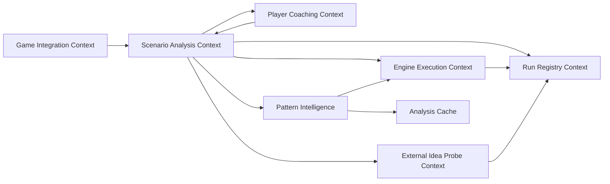

# DDD Context Map

Chess Trainer deliberately separates coaching language, scenario generation, engine execution, external probing, and persistence. The same chess move string may mean different things in different contexts, so each context owns its own language and boundaries.

## Context overview

## Player Coaching Context

### Purpose

Help the Player articulate and improve reasoning. This context owns the learning loop, not engine strength.

### Owns

- `PlayerAssessment`
- `PlayerPlan`
- candidate comparison request
- `CoachAssessment`
- `Decision`
- explanation templates and coaching rubrics

### Invariants

- The Player's original reasoning is preserved and not overwritten by the coach.
- A recommendation is labelled as advice.
- A `Decision` is not a platform command.
- The coach may not invent missing engine or bot data.

### Downstream dependencies

Consumes `ScenarioLine` and provenance data from Scenario Analysis. It should not call Stockfish, Maia, or Lichess directly.

## Scenario Analysis Context

### Purpose

Construct legal scenario lines from validated positions and typed move providers.

### Owns

- `PositionSnapshot`
- `LegalMove`
- `CandidateSeed`
- `ScenarioLine`
- `HumanPath` sequencing policy
- horizon and stop rules
- provider-result validation
- `MoveProvenance` completeness checks

### Invariants

- No provider is called before the seed is legal.
- Every appended move is legal in the current board state.
- Every appended move has complete enough provenance for its source type.
- HumanPath source order is preserved.
- Terminal board states stop generation.

### Upstream inputs

- Player seeds and requests from Player Coaching.
- Imported positions from Game Integration.
- Optional observed seeds from External Idea Probe.

### Downstream dependencies

Calls typed ports in Engine Execution and External Idea Probe. Records run metadata through Run Registry.

## Engine Execution Context

### Purpose

Turn domain requests into local engine/model calls and return domain-shaped results.

### Owns

- local style-engine adapter configuration;
- Stockfish adapter configuration;
- Maia adapter configuration;
- process lifecycle;
- UCI/runtime protocol parsing;
- timeouts and cancellation;
- raw transcript capture where permitted;
- mapping raw outputs to `LegalMove` candidates plus provenance.

### Invariants

- UCI and vendor runtime details do not enter the domain.
- Engine output is untrusted until parsed and legality-checked.
- Timeouts and malformed output return explicit errors.
- Provider identity, version, and configuration are recorded.

### Translation examples

- UCI `bestmove g1f3` becomes a domain move only after checking it is legal in the supplied `PositionSnapshot`.
- Maia top-k probabilities are adapter data until one configured move selection is validated and wrapped in provenance.
- A local style engine's `bestmove` or explicitly configured legal PV fallback is adapter data until the move is validated against the current `PositionSnapshot`.

## External Idea Probe Context

### Purpose

Obtain real bot moves from public playing bots such as LeelaAlien and Boris-Trapsky through automated bounded Lichess API game probes.

### Owns

- opt-in policy;
- quota and rate limits;
- automated challenge/game lifecycle;
- game stream consumption;
- relay move submission when required by the probe protocol;
- safe abort/resign/cleanup records;
- bot identity mapping;
- observed move extraction;
- probe audit log.

### Invariants

- A probe returns only the explicitly requested observed bot move or bounded seed set for a given position.
- A probe must not recursively branch an online search tree.
- A failed, declined, timed-out, aborted, or resigned probe is recorded as such, not converted into a guessed move.
- The Player must not create or close probe games manually in the Lichess UI; the adapter owns the API lifecycle.
- Later simulated moves are not attributed to the external bot.

## Game Integration Context

### Purpose

Import positions, games, and metadata for analysis without mutating external games.

### Owns

- FEN/PGN import;
- read-only game reference resolution;
- platform metadata normalization;
- platform credential boundary.

### Invariants

- Ordinary analysis never sends move submissions, challenge actions, chat, resign, or abort commands.
- Imported positions are validated before entering Scenario Analysis.
- Platform credentials stay outside domain data, logs, fixtures, and documentation.

## Local StylePath runtime policy

The current CLI mode keeps per-engine line state in the imperative shell. Patricia and Seer provide player-side plies at fixed depth 13, CSTal ABSURD/EXTREME at fixed depth 14, Jackal at fixed depth 8, and the Maia opponent model provides opponent plies with a 4 second movetime. Horizon growth extends each line from its tail. Root restarts happen only when the input position changes or the process restarts.

Transient provider failures are not converted into fabricated moves. Affected lines retain causal error information and retry the same ply when the failure is retryable. Jackal has a documented UCI compatibility fallback: after timeout, a legal first move from the latest observed PV may be used only for Jackal.

## Run Registry Context

### Purpose

Make analysis reproducible and auditable.

### Owns

- `runId` and `requestId` assignment;
- input position hashes;
- provider metadata;
- timestamps;
- engine/model settings;
- raw transcripts when safe and permitted;
- final provenance records.

### Invariants

- Run records are append-only.
- Redaction happens before user-facing logs or fixtures.
- The registry stores facts, not coaching conclusions.

## Anti-corruption boundaries

The domain must not import or expose:

- UCI protocol lines;
- child-process handles;
- HTTP clients;
- Lichess response shapes;
- Maia runtime-specific tensors;
- database row models;
- LLM provider schemas.

Adapters convert those unstable shapes into domain ADTs once at the boundary.

## Shared kernel

The shared kernel is intentionally small:

- chess coordinate and move notation value objects;
- `PositionSnapshot` identity/hash;
- source enums;
- structured domain errors;
- provenance requirements.

Anything tied to a specific provider belongs outside the shared kernel.

## Pattern Intelligence Context

### Purpose

Analyze StylePath trajectories as family-level combinations and mating structures without replacing the legal, provenance-bearing scenario line.

### Owns

- `PatternFamily` and structured pattern evidence;
- `PatternProgress` and `HumanReachability`;
- forced-mate precedence and mate-basin state;
- candidate-pool ranking policy.

### Invariants

- Pattern facts never create or validate a move by themselves.
- HumanReachability is not objective best defense.
- A verified ForcedMate is stored separately and disables further beauty steering.
- Pattern failures preserve the original StylePath line.

## Analysis Cache Context

### Purpose

Reuse compatible engine, Maia, pattern, and rollout state across candidate histories and jobs.

### Owns

- `ZobristPositionKey` and `RuleContext` composition;
- namespace/configuration/model-version cache keys;
- exact and partial reuse policy;
- cache hit/miss/rejection events.

### Invariants

- Piece placement, side to move, castling rights, and en-passant state form the Zobrist identity.
- Halfmove and history context are retained separately.
- Provider/model/policy configuration is part of cache compatibility.
- Cache data never invents moves or provenance.

The initial implementation uses a bounded in-memory adapter behind an application port. Durable local and shared storage remain replaceable adapters and must not leak into the domain.
