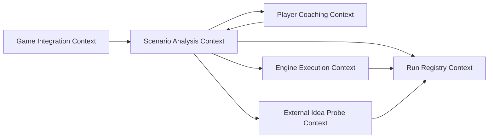

# DDD Context Map

Chess Trainer deliberately separates coaching language, scenario generation, engine execution, external probing, and persistence. The same chess move string may mean different things in different contexts, so each context owns its own language and boundaries.

## Context overview

## Player Coaching Context

### Purpose

Help the Player articulate and improve reasoning. This context owns the learning loop, not engine strength.

### Owns

- `PlayerAssessment`
- `PlayerPlan`
- candidate comparison request
- `CoachAssessment`
- `Decision`
- explanation templates and coaching rubrics

### Invariants

- The Player's original reasoning is preserved and not overwritten by the coach.
- A recommendation is labelled as advice.
- A `Decision` is not a platform command.
- The coach may not invent missing engine or bot data.

### Downstream dependencies

Consumes `ScenarioLine` and provenance data from Scenario Analysis. It should not call Stockfish, Maia, or Lichess directly.

## Scenario Analysis Context

### Purpose

Construct legal scenario lines from validated positions and typed move providers.

### Owns

- `PositionSnapshot`
- `LegalMove`
- `CandidateSeed`
- `ScenarioLine`
- `HumanPath` sequencing policy
- horizon and stop rules
- provider-result validation
- `MoveProvenance` completeness checks

### Invariants

- No provider is called before the seed is legal.
- Every appended move is legal in the current board state.
- Every appended move has complete enough provenance for its source type.
- HumanPath source order is preserved.
- Terminal board states stop generation.

### Upstream inputs

- Player seeds and requests from Player Coaching.
- Imported positions from Game Integration.
- Optional observed seeds from External Idea Probe.

### Downstream dependencies

Calls typed ports in Engine Execution and External Idea Probe. Records run metadata through Run Registry.

## Engine Execution Context

### Purpose

Turn domain requests into local engine/model calls and return domain-shaped results.

### Owns

- Stockfish adapter configuration;
- Maia adapter configuration;
- process lifecycle;
- UCI/runtime protocol parsing;
- timeouts and cancellation;
- raw transcript capture where permitted;
- mapping raw outputs to `LegalMove` candidates plus provenance.

### Invariants

- UCI and vendor runtime details do not enter the domain.
- Engine output is untrusted until parsed and legality-checked.
- Timeouts and malformed output return explicit errors.
- Provider identity, version, and configuration are recorded.

### Translation examples

- UCI `bestmove g1f3` becomes a domain move only after checking it is legal in the supplied `PositionSnapshot`.
- Maia top-k probabilities are adapter data until one configured move selection is validated and wrapped in provenance.

## External Idea Probe Context

### Purpose

Optionally obtain real first-move ideas from public playing bots such as LeelaAlien and Boris-Trapsky.

### Owns

- opt-in policy;
- quota and rate limits;
- external game lifecycle records;
- bot identity mapping;
- observed move extraction;
- probe audit log.

### Invariants

- A probe returns at most a bounded number of observed first moves for a given position.
- A probe must not recursively branch an online search tree.
- A failed or aborted probe is recorded as such, not converted into a guessed move.
- Later simulated moves are not attributed to the external bot.

## Game Integration Context

### Purpose

Import positions, games, and metadata for analysis without mutating external games.

### Owns

- FEN/PGN import;
- read-only game reference resolution;
- platform metadata normalization;
- platform credential boundary.

### Invariants

- Ordinary analysis never sends move submissions, challenge actions, chat, resign, or abort commands.
- Imported positions are validated before entering Scenario Analysis.
- Platform credentials stay outside domain data, logs, fixtures, and documentation.

## Run Registry Context

### Purpose

Make analysis reproducible and auditable.

### Owns

- `runId` and `requestId` assignment;
- input position hashes;
- provider metadata;
- timestamps;
- engine/model settings;
- raw transcripts when safe and permitted;
- final provenance records.

### Invariants

- Run records are append-only.
- Redaction happens before user-facing logs or fixtures.
- The registry stores facts, not coaching conclusions.

## Anti-corruption boundaries

The domain must not import or expose:

- UCI protocol lines;
- child-process handles;
- HTTP clients;
- Lichess response shapes;
- Maia runtime-specific tensors;
- database row models;
- LLM provider schemas.

Adapters convert those unstable shapes into domain ADTs once at the boundary.

## Shared kernel

The shared kernel is intentionally small:

- chess coordinate and move notation value objects;
- `PositionSnapshot` identity/hash;
- source enums;
- structured domain errors;
- provenance requirements.

Anything tied to a specific provider belongs outside the shared kernel.
